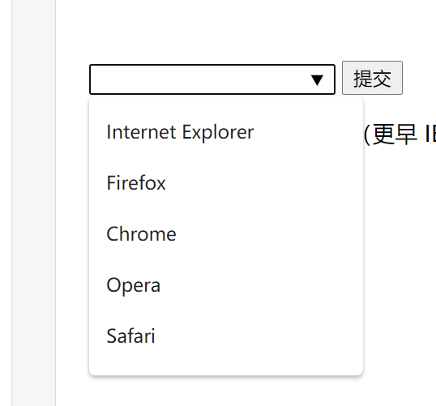

# html5

html5为了解决目前Web上存在的各种问题一并解决掉。

1. web浏览器兼容性很低
2. 文档结构不够明确
3. web程序的功能受到了限制
   

##  新特性

### 语法改变

1. DOCTYPE 声明
   ``` html
   <!-- h5 -->
   <! DOCTYPE html> 
   <!-- h4 -->
  <! DOCTYPE HTML PUBLIC "-//W3C//DTD HTML 4.01//EN" "http://www.w3.org/TR/html4/strict.dtd">
   ``

2.  指定字符编码
   ``` html
   <!-- h5 -->
  <meta charset="UTF-8" />
   <!-- h4 -->
<meta http-equiv="Content-Type" content="text/html; charset=UTF-8" />
   ``

3. 可以省略结束标记的元素 
``` html
    <body>
    <p/>Hello world!
    </body>
```

4. 新增的语义化标签
   > Section、article、aside、header、hgroup、footer、nav、figure

5. 其他标签
    >  video、audio、canvas、embed、mark、progress、meter、time、ruby、rt、rp、wbr、command、details、datalist、datagrid、keygen、output、source、menu

 6. input 类型增加
    > Email、url、number、range、DatePickers

7. 废除的标签
   > + frame
     + 能使用CSS替代的basefont、big、center、font、s、tt、u等
     + 只有部分浏览器支持的元素
  8. 新增的全局属性
   全局属性是指对所有标签都可以使用的属性
  > contentEditable、designMode、tabindex、spellcheck、hidden

#### 新增的语义化标签

+ &lt;header&gt;&lt;/header&gt; 页眉
+ &lt;footer&gt;&lt;/footer&gt;页脚
+ &lt;nav&gt;&lt;/nav&gt; 导航 (包含链接的的一个列表)
+ &lt;hgroup&gt;&lt;/hgroup&gt; 页面上的一个标题组合
+ &lt;section&gt;&lt;/section&gt; 页面上的板块--用于划分页面上的不同区域,或者划分文章里不同的节
+ &lt;article&gt;&lt;/article &gt; 用来在页面中表示一套结构完整且独立的内容部分
+ &lt;aside&gt;&lt;/aside&gt;  该元素标签可以包含与当前页面或主要内容相关的引用、侧边栏、广告、nav元素组，以及其他类似的有别与主要内容的部分
+ &lt;figure&gt;&lt;/figure&gt;用于对元素进行组合。一般用于图片或视频 
+ &lt;address&gt;&lt;/address&gt;元素用来在文档中呈现联系信息，包


### 表单内新增的元素和属性

+ &lt;datalist&gt; 用于input 输入提示
``` html
<input list="browsers">
<datalist id="browsers">
  <option value="Internet Explorer">
  <option value="Firefox">
  <option value="Chrome">
  <option value="Opera">
  <option value="Safari">
</datalist>

```


+  &lt;keygen&gt;
+  &lt;output&gt;