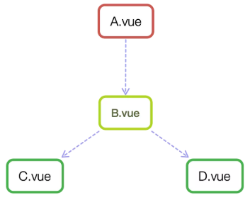

# 组件通信
[Vue组件通信六种方式](https://segmentfault.com/a/1190000019208626)  

   
## 父子组件通信（针对Vue）  
1. props  
[props说明](https://cn.vuejs.org/v2/api/#props)  
 使用
 父组件内使用子组件，并在子组件内绑定属性值
 ``` javascript
 <Parent>
 <child v-bind:data=data />
 </Parent>

 //子组件内
 export default {
     name:"Child",
     props:{
         data:{
             type:Array,//类型
             default:[],//默认值
             require:false,//是否必须
             validator:function(){//自定义函数验证
                 return 
             }
         }
     }
     data(){
         return {    
         }
     }
 }
 ```
> 拓展：子组件中的数据有三种形式：
> 1. props，父组件传下来的值
> 2. data， 自己申明的值
> 3. computed,计算属性，

## 子组件向父组件传值
1. 事件  
[v-on说明](https://cn.vuejs.org/v2/api/#v-on)  
[vm.$emit说明](https://cn.vuejs.org/v2/api/#vm-emit)  
子组件向父组件传值，通过事件，子组件触发当前实例上的事件，父组件监听事件
``` javascript
<Parent v-on:updateParent="updateName">
<child/>
</Parent>
export default {
    name:'Parent',
    methods:{
        updateName(){

        }
    }
}
 //子组件内
 export default {
     name:"Child",
     data(){
         return {  
             name:"hello"  
         }
     },
     methods:{
         updateParentName(){
             this.$emit("updateParent",name)
         }
     }
 }

```
### 进阶
通过一个空的Vue实例作为中央事件总线（事件中心），用它来触发事件和监听事件,巧妙而
轻量地实现了任何组件间的通信，包括父子、兄弟、跨级。当我们的项目比较大时，可以选择更好的
状态管理解决方案vuex。
``` javascript
    var Event=new Vue();
    Event.$emit(事件名,数据);
    Event.$on(事件名,data => {});
```
使用时，直接引入这个Event，调用这个Event的事件方法。即可。

## Vuex
[Vuex说明](https://cn.vuejs.org/v2/guide/migration-vuex.html#ad)   
> Vuex采用发布订阅模式

## \$attrs/$listeners
### \$attrs
[官网说明](https://cn.vuejs.org/v2/api/#vm-attrs)   
仅仅传递数据，而不进行数据处理。 
>包含了父作用域中，不被props识别且获取的attribute的绑定（class，style除外）。当一个父组件没有申明任何一个prop时候，这个\$attr会包括该父组件所有的作用域绑定的，并且可以通过v-bind："$attrs"传入内部组件。
> 类型 {key:string ：value:string}

### \$listeners


>包含了父作用域中的 (不含 .native 修饰器的) v-on 事件监听器。它可以通过 v-on="$listeners" 传入内部组件——在创建更高层次的组件时非常有用。
>类型：{ [key: string]: Function | Array<Function> }

使用
``` javascript
<Parent >
<Child :name="hello" :type="zn" >
</Child>
</Parent>

//Child 
<div>{{name}}</div>
<div>{{$attrs}}</div>
export default {
    name:"Child";
//console.log(this.$attrs)
}
```

## provide/inject
[官网说明](https://cn.vuejs.org/v2/api/?#provide-inject)   
> 跨组件同行时，较为常用，允许一个祖先组件向其所以子孙组件注入一个依赖，只要存在组件的父子，祖孙这种上下游关系，始终生效，无关组件层次的深浅。
> 祖先组件通过provider提供变量，子组件通过inject注入变量


``` javascript
    //Parent
    export default {
        name:"Parent",
        provide:{
            name:"wxy"
        }
    }
    //Child
    export default {
        name:"Child",
        inject:['name'];
        //console.log(this.name)
    }

```
注意：
provide 和 inject 主要在开发高阶插件/组件库时使用。并不推荐用于普通应用程序代码中。  

## \$parent / $children 与ref
[$refs](https://cn.vuejs.org/v2/api/#vm-refs)
> $refs是一个对象，持有注册过 ref attribute 的所有 DOM 元素和组件实例。
使用
``` javascript
<Componet ref="componetA"></Component>
// console.log(this.$refs.componentA)

```
\$parent/$children:获取父/子组件的实例
注意：
1.这两种都是通过得到这个组件的实例，所以能够直接调用组件的方法和数据。
2.无法跨组件通信和兄弟组件通信


## 单例模式
### 使用
重新创建一个class，作为store，里面存放需要保存的变量和需要的操作，对变量的修改，需要通过该类的方法修改。然后导出这个类的实例
``` javascript
class Store {
    constuctor(){
        this._state={
            time:0,
            data:[]
        }
    }
    get state(){
        return this._state;
    }
    set state(val){
        this._state=val
    }
    editTime(val){
        this._state.time=val
    }
} 
export const Store =new Store();
```
使用时，只需
``` javascript
imprt {Store }from 'Store'
```
这种方法类似Vuex，利用class，保存变量，和进行与页面无关的操作。


# 总结
常见使用场景可以分为三类：  
1. 父子通信： 父向子传递数据是通过 props，子向父是通过 events（\$emit）；通过父链 / 子链也可以通信（$parent / \$children）；ref 也可以访问组件实例；provide / inject API；\$attrs/\$listeners  
2. 兄弟通信： Bus；Vuex 
3. 跨级通信： Bus；Vuex；provide / inject API、$attrs/$listeners