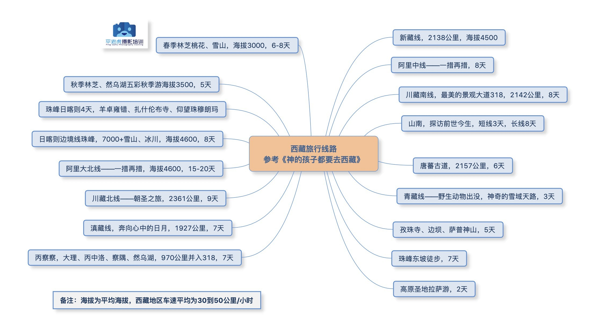
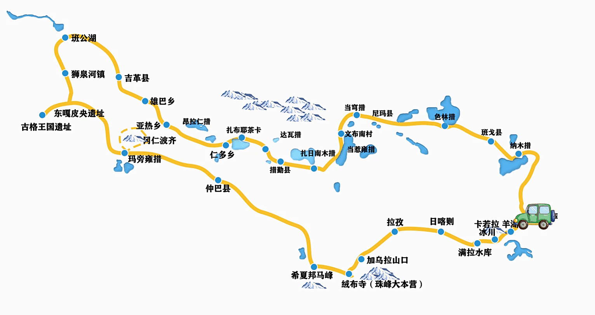
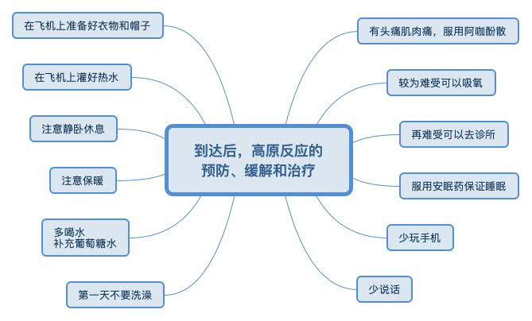

# 西藏旅游计划

## 时间

#### 14天 9.24-10.7 14天 = 事假(2)+年假(5)+国庆(7)

01. 9.23 出发,拉萨休整一天，25 出发

## 出发与返回

出发
01.  寄行李 苏州到西藏 130+，
02.  苏州到无锡 50
03.  无锡住宿 200+
04.  无锡-拉萨  飞机1900
   合计2300

返回
计划从西藏飞到成都，成都再火车或飞机

01. 1
02. 2
03. 3
04. 3  

## 景点

01.  布达拉宫

> 西藏拉萨市中心北京中路的红山

02. 珠峰

> 西坡大本营在西藏自治区日喀则地区定日县扎西宗乡，东坡大本营在定日县曲当乡的嘎玛沟地带---边防证

03. 纳木错

> 纳木错，西藏三大圣湖之一，也是最大的圣湖，位于西藏自治区中部，是西藏第二大湖泊，也是中国第三大的咸水湖，纳木措的北岸圣象天门

04. 雅鲁藏布大峡谷

> 雅鲁藏布大峡谷是地球上最深的峡谷。大峡谷北起米林县派镇大渡卡村（海拔3000米），主体在墨脱

05. 40冰川

06. 色林措

> 西藏第一大湖

## 路线

 
 总路线
 

### 阿里大北线13天行程

01. Day1：拉萨一羊卓雍措一卡若拉冰川一满拉水库一日喀则
02. Day2：日喀则一扎什伦布寺—拉孜一定日一久乌拉山口一加措拉山口一绒布寺一珠峰(日落、星空、日出
03. Day3：珠峰大本营一老定日一希夏邦马峰一佩枯措一萨嘎—仲巴
04. Day4：仲巴—马泉河湿地公园—公珠措—冈仁波齐（神山）—塔尔钦
05. Day5：塔尔钦—玛旁雍措环湖（车环）—拉昂措（鬼湖）—塔尔钦
06. Day6：塔尔钦—皮央石窟群—扎达土林—古格王朝（一夜之间消失的文明）—托林寺—扎达
07. Day7：扎达—狮泉河—班公措—日土岩画—狮泉河
08. Day8：狮泉河镇—革吉县—雄巴乡—亚热乡一仁多乡
09. Day9：仁多乡—仁青休布措—达瓦措—昂拉仁措—扎布耶茶卡盐湖—措勤县（今天看到多种野生动物以及一措再的惊艳，体验大自然原生态的精华）
10. Day10：措勤—扎日南木措—当惹雍措一文布南村
11. Day11：文布南村—文布北村一当穷错一尼玛一色林措一班戈措——班戈
12. Day12：班戈——圣象天门（纳木措 北岸）
13. Day13：圣象天门（纳木错北岸）一扎西半岛(纳木错南岸)—那根拉山口一念青唐古拉山一拉萨

## 准备

01. 病 || 症状 

> 一周前，可以先口服红景天胶囊或者口服液等，从心理上对预防高反有用。。高反神药——阿咖酚散

02. 衣物

> 购置防风保暖的抓绒拉链上衣、防风挡雨的防风外套、遮阳的宽檐户外帽子、保暖的毛线帽、厚手套、厚的袜子和保暖的鞋子休息时候穿的塑料底拖鞋（最好自带）

03. 交通

> 飞机：航班选择两大要点：一是不要选择长途奔袭一下子到拉萨的航班，过度疲劳会加剧高反的不舒适。二是不要选择下午抵达西藏的航班，西藏全境大概率下午开始刮狂风，航班基本有一半概率无法降落返回出发地，然后第二天再飞过去。

04. 天气

> 西藏的一个县，可能比青岛市大，所以在西藏：不要看天气预报安排行程和衣物

05. 证件

> 边防证：前往阿里地区、珠峰地区、40冰川等地区都需要边防证，

> 办理全境的，有效期三个月

办理方式：
01.  出发前证件去户口所在地派出所办理，几天后能取（听说现在异地也能办理了？不了解）
02.  到达拉萨后去拉萨边防大厅办理，不过自己去办理很麻烦，不推荐。
03.  ota平台等等搜边防证，托商家给办理，现在好像办理下来将近二百了，几个小时就可以了。
04.  很多报团或者拼包车司机或旅行社会赠送此项目
